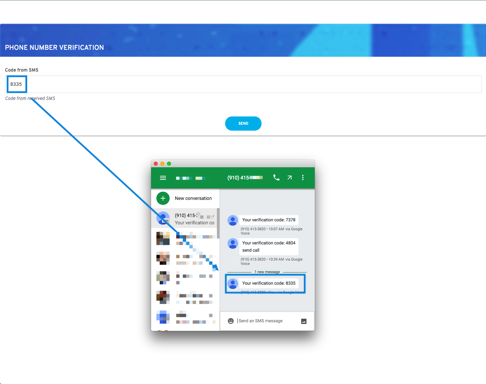
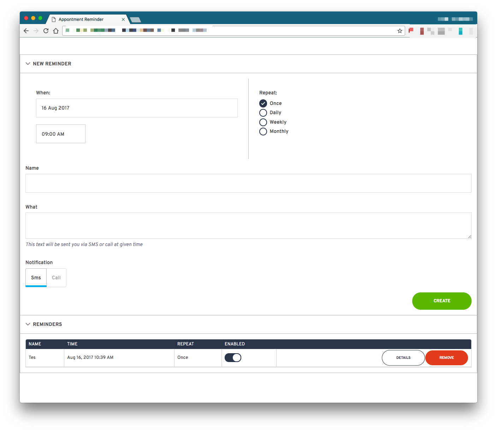

# Appointment Reminder Ruby Example

[](https://travis-ci.org/BandwidthExamples/ruby-appointment-reminder)

Appointment reminders app for [Bandwidth Voice and Messaging APIs](http://dev.bandwidth.com).

[](https://heroku.com/deploy)

## Table of Contents

* [What this Example Does](#what-this-example-does)
* [Prerequisites](#prerequisites)
    * [Env Variables](#env-variables)
* [Deploy Locally](#deploying-locally-with-ngrok)
    * [Directly](#directly)
    * [Docker](#via-docker)

## What this Example Does

This application allows you to create an account and login with your phone number. Once you are logged in you can setup and send yourself a reminder!

Features
* Call or text
* Recurring (daily, weekly)
* Toggle reminders on/off

This app demonstrates:
* [Sending a code to a phonenumber to log in](http://dev.bandwidth.com/howto/sendSMSMMS.html)
    * [Send Message](https://github.com/BandwidthExamples/ruby-appointment-reminder/blob/master/helper.rb#L64)
* [Creating a call](http://dev.bandwidth.com/howto/outboundCall.html) and [speaking sentence](http://dev.bandwidth.com/ap-docs/methods/calls/postCallsCallIdAudio.html)
    * [Creating a call](https://github.com/BandwidthExamples/ruby-appointment-reminder/blob/master/reminder_scheduler.rb#L34)
    * [Speak Sentence](https://github.com/BandwidthExamples/ruby-appointment-reminder/blob/master/app.rb#L66)

## Prerequisites

### Accounts and Machine Setup
* [Bandwidth Voice and Messaging APIs Account](http://dev.bandwidth.com)
    * [If you already have a Bandwidth Account](http://dev.bandwidth.com/security.html)
* [Nodejs](https://nodejs.org/en/)
* [Yarn](https://yarnpkg.com/)
* [Ruby 2.4+](https://www.ruby-lang.org)
* [MongoDB](https://docs.mongodb.com/manual/installation)
* [Git](https://git-scm.com/)
* [Ngrok](https://ngrok.com/) **For local Deployment Only**
* [Heroku](https://signup.heroku.com/) **For Heroku Deployment Only**

### Env Variables
* `BANDWIDTH_USER_ID` - Something like `u-asdf`
* `BANDWIDTH_API_TOKEN` - Something like `t-asf234`
* `BANDWIDTH_API_SECRET` - Something like `asdf123asdf`
* `DATABASE_URL` - Connection path to MONGO DB like `mongodb://localhost:27017`

## Deploying Locally with ngrok

[Ngrok](https://ngrok.com) is an awesome tool that lets you open up local ports to the internet.


Once you have ngrok installed, open a new terminal tab and navigate to it's location on the file system and run:

```bash
$ ./ngrok http 3000
```

You'll see the terminal show you information


### Installing and running

Once [ngrok](#deploying-locally-with-ngrok) is up and running. Open a new tab and clone the repo:

```bash
git clone https://github.com/BandwidthExamples/ruby-appointment-reminder.git
cd ruby-appointment-reminder
```

### Directly

```bash
# install node js (https://nodejs.org/en/) and yarn (https://yarnpkg.com/)
# install or run mongodb. Set environment variable DATABASE_URL to right value for your mongodb instance

bundle install # to install gems

export BANDWIDTH_USER_ID=<YOUR-USER-ID>
export BANDWIDTH_API_TOKEN=<YOUR-API-TOKEN>
export BANDWIDTH_API_SECRET=<YOUR-API-SECRET>
export DATABASE_URL=<YOUR-MONGO-URI>

rake build # to build frontend

PORT=3000 rake # to start web app and sheduler

# Open in browser url shown by ngrok

```

### Via Docker

```bash
# fill .env file with right values
# vim ./.env

# then run the app (it will listen port 8080)
PORT=3000 docker-compose up -d
# Open in browser url shown by ngrok

```


### Open the app using the `ngrok` url

When the app runs for the first time, it setups the Bandwidth voice and messaging callbacks for the application for you.  It sets the callback urls based on the url visited!

Copy the `http://8a543f5f.ngrok.io` link and paste it into your browser.

> On first run, the application will create the Bandwidth callbacks and voice/messaging application for you.  Be sure you visit the `ngrok` url and not `localhost`. Bandwidth needs to be able to send callbacks.



